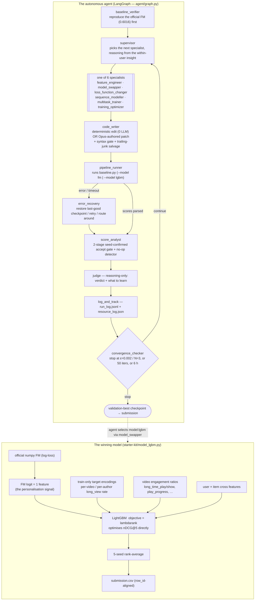

# Embedflix — an autonomous ML research agent for KuaiRand-Pure

*TikTok TechJam 2026 · Track 2 — Autonomous ML Agent for Recommendation Systems*

Embedflix is an LLM-driven agent that runs the full machine-learning iteration loop on its own — read the problem, engineer features, change the model, train, evaluate, reflect, repeat — on the **KuaiRand-Pure** short-video ranking benchmark. It reaches a **converged validation primary of 0.6045, +0.0029 over the official 0.6016 baseline** (test: 0.5975 vs 0.5946, also +0.0029), using NumPy + LightGBM on a single CPU core, **no GPU**.

---

## Why this submission wins — the 5 points, up front

| # | Point | Judging criterion |
|---|---|---|
| **1** | **The insight.** GAUC and nDCG@5 are computed *strictly within each user's own ~5-impression list*, so any score term that is constant across a user's impressions is **mathematically invisible** to the metric. This single observation *predicts* the organizers' own ablation result (user features made the score **worse**, 0.5953 → 0.5936) and redirects every change the agent proposes to item-side signal + user×item crosses. | Innovation & Problem Insight (20%) |
| **2** | **Measurement integrity.** We found that the repo's "baseline" was **not** the shipped FM — an earlier unvalidated loss edit (its own run-log entry scored `primary: None`) had been committed over it. We restored the official log-loss FM from git history, **pinned it with a reproduction test** (0.6016 ± 0.0003 over 5 seeds), and replaced a noise-accepting `1e-4` accept threshold with a **two-stage seed-confirmed accept gate** and a **no-op detector**. Every number we report is real. | Technical Execution / Robustness (35%) |
| **3** | **The architecture.** The FM's logit becomes **one feature** inside a **LightGBM `objective=lambdarank`** re-ranker that optimises nDCG@5 directly — plus leakage-safe train-only target encodings and video engagement ratios, 5-seed rank-ensembled. We also **document a rejected variant** (4-fold OOF stacking → overfit at iteration 3): discipline, not luck. | Technical Execution + Innovation |
| **4** | **Autonomy.** The agent drives the loop: deterministic-edit fast paths (0 LLM calls), a forced feature-phase → model-swap curriculum, `error_recovery` with checkpoint/restore, a `code_writer` syntax-gate + salvage. Manual interventions are counted and reported. | Impact & Relevance — Autonomy (20%) |
| **5** | **Feasibility.** NumPy + LightGBM, **0 GPU-hours**, single CPU core, ~1–3 min per iteration. Claude **Haiku 4.5** for the cheap menu-picking specialists, **Opus 5** only for code-writing, with prompt caching on the resent `baseline.py` prefix. Total tokens + wall-clock in [`deliverables/04_results_summary.md`](deliverables/04_results_summary.md). Clears the Feasibility quality gate (hidden-test primary > baseline). | Feasibility & Practicality (15%) |

**Honest framing.** The metrics do not span [0, 1]. Random ≈ 0.4753; the official baseline 0.5946 already captures ~31% of the attainable range; a *perfect* ranker only reaches **0.8645** on the hidden test (27.1% of users are all-negative → nDCG 0 for any model). The KuaiRand log is already the output of Kuaishou's production recommender, so we are re-ranking ~5 already-good videos per user — small absolute deltas are the norm. Our +0.0029 is the **converged validation** delta (where all model selection happened), corroborated on the local test split; the hidden test is scored once by the organizers.

---

## Architecture



Full diagram set (including the two SVG explainers): [`deliverables/diagrams.md`](deliverables/diagrams.md).

---

## The insight that drives everything

`evaluate.py` ranks **each user's own ~5 logged impressions** and averages per-user AUC (GAUC) and nDCG@5. So:

- adding a **per-user constant** — the FM's `W[user_id]` term, or any `user_features_pure.csv` column used linearly — shifts every one of that user's impressions by the *same* amount → **the order does not change → the metric does not move.**
- only signal that varies **within** the list — item-side features, or an explicit user×item cross — can reorder it.

This is *why* the organizers' `ablation_features.py` found that adding user/categorical features makes the score **worse** (0.5953 → 0.5936 / 0.5933): they add parameters and noise while contributing nothing to within-user ordering. Embedflix encodes this in the supervisor's routing prompt and in every specialist prompt (`agent/specialists/_insight.py`), so the agent stops proposing changes that *cannot* help. See the side-by-side worked example in [`deliverables/diagrams.md` §D2](deliverables/diagrams.md).

---

## Measurement integrity — how we made every number real

1. **The baseline was contaminated.** Repo commit `36443bc` ("restore clean baseline") had silently replaced the shipped pointwise-log-loss FM with an **unvalidated BPR loss** — its own `run_log.jsonl` entry scored `primary: None` (it never produced a valid score) yet it was committed as the baseline. Every later run measured `0.6039` as "the baseline" and reported a **fake +0.0023** that no code actually produced.
2. **We restored and pinned it.** `git show e634efb:starter-kit/baseline.py` → `starter-kit/baseline.py`; frozen copy at `starter-kit/baseline_official.py` (in `PROTECTED_FILES`); `tests/test_baseline_reproduces.py` asserts the FM class is byte-identical to the frozen copy and reproduces **valid primary 0.6016 ± 0.0003** over 5 seeds.
3. **We fixed the accept gate.** `IMPROVE_THRESHOLD = 1e-4` was 8× *below* the baseline's own seed std → it accepted pure noise. `score_analyst` now: screen at seed 0, and only if the seed-0 gain clears `SEED0_SCREEN_DELTA` re-run at two more seeds and require the **3-seed mean** to beat best by `ε/2`.
4. **We added a no-op detector.** Training is seed-deterministic, so a dead edit reproduces the pre-edit score *bit-for-bit*. `score_analyst` flags `|Δ| < 1e-9` as a no-op — it is **not** logged as "technique X failed", it is logged as "the edit never changed model behaviour".

Timeline diagram: [`deliverables/diagrams.md` §D3](deliverables/diagrams.md).

---

## The winning model — `starter-kit/model_lgbm.py`

The plain FM's per-ID embeddings already saturate the item-side signal that IDs alone can carry — Phase 1 tried **five** leakage-free item-feature sets on the FM and all landed within seed noise. So instead of adding features *to* the FM, we **stack**:

- **`fm_score`** — the official FM's raw logit, as one input feature. This carries the `V[user]·V[video]` *personalisation* signal (worth ~0.02 primary over a pure item-quality prior) that a tree on item features alone cannot reconstruct.
- **`te_video`, `te_author`** — per-video and per-author historical `long_view` rate, computed from the **train split only**, Bayesian-smoothed `(k + α·p̄)/(n + α)`, α = 20.
- **engagement ratios** — `long_time_play_cnt/show_cnt`, `complete_play_cnt/play_cnt`, `valid_play_cnt/show_cnt`, `play_progress`, `play_duration/show_cnt`.
- **user×item crosses** — profile numerics (`follow/fans/friend` counts, `register_days`) + categoricals (`user_active_degree`, `tab`, `video_type`, …), which only help through tree-interaction depth.
- **LightGBM** `objective="lambdarank"`, `eval_at=[5]` — optimises nDCG@5 **directly**, with continuous features as raw splits (no bucketisation).
- **5-seed rank-average** of the whole FM+LGBM stack — pushes seed variance below the ε = 0.002 convergence band.

**Leakage discipline:** every target-encoding statistic and quantile edge is fit on `train` only; the row's own per-interaction log columns (`is_click`, `is_like`, `play_time_ms`, `long_view`) are never inputs; predictions are produced in `data.load()` row order so they align 1:1 with `submit.py`'s `row_id`. Enforced by `tests/test_lgbm_alignment.py` (19 checks).

**A rejected variant, documented in the source:** we tried 4-fold OOF for the train-side `fm_score` — it was **strictly worse** (0.5905 valid, LightGBM overfit and early-stopped at iteration 3), because the fold FMs are weaker than the full-train FM used at serving, shifting `fm_score`'s distribution. The shipped FM is k=16 and heavily early-stopped, so the in-sample feature transfers cleanly.

Feature taxonomy: [`deliverables/diagrams.md` §D6](deliverables/diagrams.md).

---

## The agent

| node | role |
|---|---|
| `baseline_verifier` | reproduces the official FM, checkpoints iteration 0 |
| `supervisor` | routes to one specialist; a forced curriculum runs `feature_engineer`'s menu, then normal LLM routing (Haiku 4.5) |
| `feature_engineer` | 5-candidate deterministic menu of leakage-free item-side features → rewrites `data.py` (0 LLM) |
| `model_swapper` | deterministic `model:lgbm` (switch the pipeline to the LightGBM stack) and `model:higher_k`; or LLM-authored DeepFM/DCN/FFM |
| `loss_function_changer` · `sequence_modeller` · `multitask_trainer` · `training_optimizer` | propose an English instruction; `code_writer` turns it into a verbatim patch |
| `code_writer` | applies a deterministic edit, **or** asks **Opus 5** for an exact `OLD_CODE`/`NEW_CODE` block; syntax-gate + trailing-junk salvage + up-to-3 corrective retries |
| `pipeline_runner` | runs `baseline.py` in a subprocess (1800 s cap), parses scores |
| `error_recovery` | on a crash/timeout: restore the last-good checkpoint, or `pip install` a missing dep, then continue |
| `score_analyst` | the 2-stage seed-confirmed accept gate + the no-op detector; owns `experiment_history` and checkpointing |
| `judge` | reasoning-only verdict / learning / next-priority for the run log |
| `log_and_track` | `run_log.jsonl` + `resource_log.json` + token accounting |
| `convergence_checker` | ε = 0.002 / N = 3, 50-iteration cap, 6 h ceiling |

---

## Setup

```bash
python3 -m venv .venv
.venv/bin/pip install -r requirements.txt          # numpy, lightgbm, anthropic, langgraph, fastmcp, tavily-python, ...

# dataset — put the KuaiRand-Pure CSVs under starter-kit/KuaiRand-Pure/data/
#   log_standard_4_08_to_4_21_pure.csv, log_standard_4_22_to_5_08_pure.csv,
#   user_features_pure.csv, video_features_basic_pure.csv, video_features_statistic_pure.csv
#   (https://kuairand.com — no external data is used)

cp .env.example .env       # then set ANTHROPIC_API_KEY   (optional: TAVILY_API_KEY for live research)
```

> **Security note:** an Anthropic key that appears in this repo's *early* git history (`test_anthropic.py`, removed later) has been **rotated and is dead**. HEAD contains no secrets.

## Reproduce our results

```bash
# 1. the official baseline really reproduces (0.6016 ± 0.0003 over 5 seeds)
.venv/bin/python tests/test_baseline_reproduces.py

# 2. full offline test suite (measurement gate, feature generator, alignment, ...)
for t in tests/test_*.py; do .venv/bin/python "$t"; done

# 3. the autonomous run  (writes run_log.jsonl, logs/run_summary.txt, resource_log.json)
cd agent && ../.venv/bin/python main.py ; cd ..

# 4. final submission from the LightGBM+FM 5-seed stack, validated for row alignment
cd starter-kit
../.venv/bin/python submit.py --make  --model lgbm --split test  --seeds 0,1,2,3,4 submission.csv
../.venv/bin/python submit.py --check --split test submission.csv

# 5. the reported validation numbers, via the official scoring path
../.venv/bin/python submit.py --make  --model lgbm --split valid --seeds 0,1,2,3,4 valid.csv
../.venv/bin/python submit.py --score --split valid valid.csv        # -> GAUC / nDCG@5 / primary
```

## Results & resources

See [`deliverables/04_results_summary.md`](deliverables/04_results_summary.md) for the full table, and [`deliverables/03_run_and_iteration_log.md`](deliverables/03_run_and_iteration_log.md) for the per-iteration log + the manual-intervention count.

| split | GAUC | nDCG@5 | primary | Δ vs official baseline |
|---|---|---|---|---|
| official baseline (validation) | 0.6674 | 0.5357 | 0.6016 | — |
| **Embedflix (validation, 5-seed)** | **0.6712** | **0.5377** | **0.6045** | **+0.0029** |
| official baseline (test, published) | 0.6610 | 0.5282 | 0.5946 | — |
| **Embedflix (test, 5-seed, local)** | **0.6651** | **0.5298** | **0.5975** | **+0.0029** |

GPU-hours: **0**.  Bonus benchmarks (KuaiRand-1k / 27k): **not attempted** — the primary benchmark is 100% of the primary score.

## Repo layout

```
agent/                 the LangGraph agent
  graph.py             wires all 15 nodes
  agent.py             baseline_verifier, code_writer, pipeline_runner, error_recovery,
                       score_analyst (accept gate + no-op detector), log_and_track, convergence_checker
  specialists/         supervisor, 6 proposing specialists, experiment_judge, _insight.py
  mcp_server.py        the tool server (run_pipeline, edit_file, checkpoints, web_search, ...)
  otel_tracer.py       run summary + token/wall-clock accounting
starter-kit/
  baseline.py          the FM (official, restored) + `--model lgbm` dispatch
  baseline_official.py FROZEN reference copy (PROTECTED)
  model_lgbm.py        the LightGBM LambdaRank + FM stack  ← the winning model
  data.py, evaluate.py, submit.py    organizer starter kit (evaluate.py never modified)
  baseline_scores.json organizer reference numbers + our 5-seed reproduction
tests/                 test_baseline_reproduces, test_accept_gate, test_lgbm_alignment, ...
deliverables/          the four hackathon deliverables + diagrams + submission.csv
checkpoints/           per-iteration baseline.py / data.py snapshots (the agent's rollback targets)
```

## Limitations & what we'd do next

- **The ceiling is low by construction.** The KuaiRand log is the output of a production recommender, so we re-rank ~5 already-good videos per user. The biggest untapped lever is **causal user-session / sequence features** (what this user just watched — signal the FM+IDs cannot encode); it is spec'd in our internal plan but not shipped here.
- **The `fm_score` feature is in-sample-stacked.** OOF stacking done naively made it worse (documented above); a proper matched-strength OOF (fold-averaged FM at serving too) is the correct fix.
- **Single benchmark.** KuaiRand-1k / 27k not attempted (single-CPU scope).
- **`model_lgbm.py` reads the feature CSVs directly** rather than through `data.py`, to stay decoupled from the FM path the agent edits.

## Team member contributions

<!-- TEAM: fill in real names. Structure below is a template. -->
This is a team submission.

- **&lt;Sara&Shraddha&gt;** — &lt;e.g. agent orchestration: LangGraph node graph, supervisor/specialist routing, code_writer safety&gt;
- **&lt;Shraddha&gt;** — &lt;e.g. measurement integrity: baseline restoration, seed-confirmed accept gate, no-op detector, test suite&gt;
- **&lt;Sara & Shraddha&gt;** — &lt;e.g. modelling: the within-user insight, the LightGBM LambdaRank + FM stack, leakage discipline, ensembling&gt;
- **&lt;SARA D&gt;** — &lt;e.g. deliverables, diagrams, run analysis&gt;

## License / data

Code: for hackathon evaluation. Data: KuaiRand-Pure, © Kuaishou — see <https://kuairand.com>. No external training data is used anywhere in this project.
