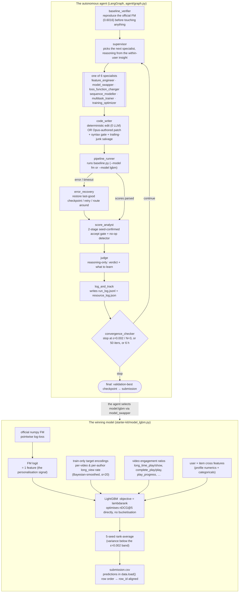
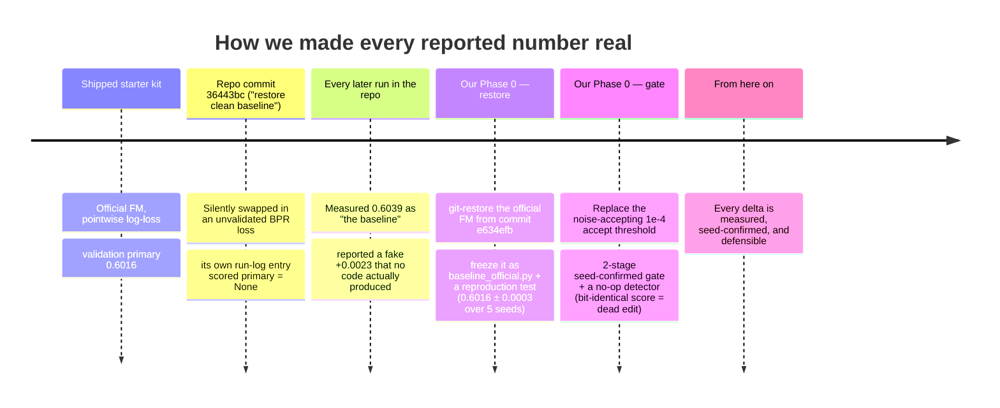
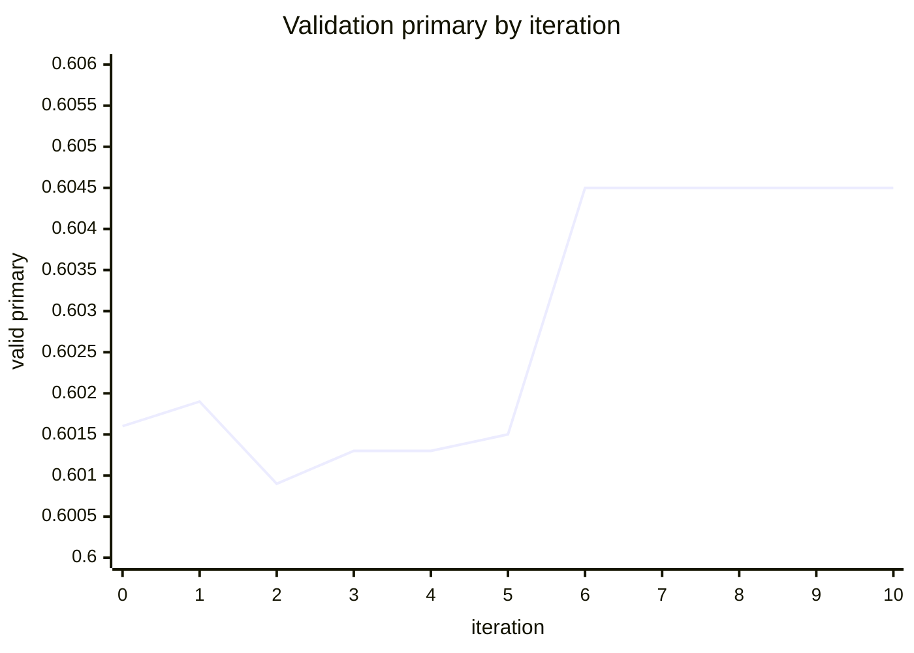

<!--
Shared diagram source for all embedflix deliverables.
Mermaid blocks render natively on GitHub and Devpost. The two SVGs (D2, D4)
are hand-drawn for clarity and can be screenshotted straight into Devpost.
Every label is plain English on purpose.
-->

# Embedflix — diagrams

## D1 — System architecture: the agent loop + the winning model



---

## D2 — The core insight: *within-user invariance* (the innovation diagram)

`evaluate.py` computes GAUC and nDCG@5 **strictly inside each user's own ~5-impression list**. So a score term that shifts every one of a user's impressions by the *same* amount cannot change their order — it is mathematically invisible to the metric. Only signal that varies *within* the list (item-side, or a user×item cross) can move the score.

<svg viewBox="0 0 880 430" xmlns="http://www.w3.org/2000/svg" font-family="ui-sans-serif, system-ui, sans-serif">
  <style>
    .h{font-size:15px;font-weight:700}
    .s{font-size:13px;font-weight:700}
    .m{font-size:11px;fill:#555}
    .bar{fill:#cbd5e1}
    .barI{fill:#6366f1}
    .ok{font-size:13px;fill:#15803d;font-weight:700}
    .bad{font-size:13px;fill:#b91c1c;font-weight:700}
    .rl{font-size:11px;fill:#888}
  </style>

  <text x="20" y="24" class="h">One user's 5 impressions — score them, sort them. Does the ORDER change?</text>

  <!-- ============ LEFT: per-user constant ============ -->
  <text x="20" y="56" class="s">Add a per-user constant  (W[user_id], any user-profile feature used linearly)</text>
  <text x="20" y="73" class="m">every impression moves by the same +0.10</text>

  <text x="30" y="98" class="rl">BEFORE</text>
  <g transform="translate(30,104)">
    <rect class="bar" x="0" y="0"  width="128" height="13"/><text x="134" y="10" class="m">video A · 0.80</text>
    <rect class="bar" x="0" y="18" width="96"  height="13"/><text x="134" y="28" class="m">video B · 0.60</text>
    <rect class="bar" x="0" y="36" width="80"  height="13"/><text x="134" y="46" class="m">video C · 0.50</text>
    <rect class="bar" x="0" y="54" width="64"  height="13"/><text x="134" y="64" class="m">video D · 0.40</text>
    <rect class="bar" x="0" y="72" width="48"  height="13"/><text x="134" y="82" class="m">video E · 0.30</text>
  </g>
  <text x="252" y="150" font-size="18" fill="#999">&#8594;</text>
  <text x="286" y="98" class="rl">AFTER (+0.10 each)</text>
  <g transform="translate(286,104)">
    <rect class="bar" x="0" y="0"  width="144" height="13"/><text x="150" y="10" class="m">video A · 0.90</text>
    <rect class="bar" x="0" y="18" width="112" height="13"/><text x="150" y="28" class="m">video B · 0.70</text>
    <rect class="bar" x="0" y="36" width="96"  height="13"/><text x="150" y="46" class="m">video C · 0.60</text>
    <rect class="bar" x="0" y="54" width="80"  height="13"/><text x="150" y="64" class="m">video D · 0.50</text>
    <rect class="bar" x="0" y="72" width="64"  height="13"/><text x="150" y="82" class="m">video E · 0.40</text>
  </g>
  <text x="20" y="212" class="bad">Order: A B C D E  →  A B C D E.  Identical. GAUC / nDCG@5 do not move. INVISIBLE.</text>

  <line x1="20" y1="230" x2="860" y2="230" stroke="#e5e7eb"/>

  <!-- ============ RIGHT: item-side vector ============ -->
  <text x="20" y="258" class="s">Add an item-side term  (this video's long_view rate, an engagement ratio)</text>
  <text x="20" y="275" class="m">each impression moves by a DIFFERENT amount: A +0.30, B &#8722;0.10, C +0.20, D &#8722;0.20, E 0.00</text>

  <text x="30" y="300" class="rl">BEFORE</text>
  <g transform="translate(30,306)">
    <rect class="bar" x="0" y="0"  width="128" height="13"/><text x="134" y="10" class="m">video A · 0.80</text>
    <rect class="bar" x="0" y="18" width="96"  height="13"/><text x="134" y="28" class="m">video B · 0.60</text>
    <rect class="bar" x="0" y="36" width="80"  height="13"/><text x="134" y="46" class="m">video C · 0.50</text>
    <rect class="bar" x="0" y="54" width="64"  height="13"/><text x="134" y="64" class="m">video D · 0.40</text>
    <rect class="bar" x="0" y="72" width="48"  height="13"/><text x="134" y="82" class="m">video E · 0.30</text>
  </g>
  <text x="252" y="352" font-size="18" fill="#999">&#8594;</text>
  <text x="286" y="300" class="rl">AFTER — re-sorted</text>
  <g transform="translate(286,306)">
    <rect class="barI" x="0" y="0"  width="176" height="13"/><text x="182" y="10" class="m">video A · 1.10</text>
    <rect class="barI" x="0" y="18" width="112" height="13"/><text x="182" y="28" class="m">video C · 0.70   &#8593; up from #3</text>
    <rect class="barI" x="0" y="36" width="80"  height="13"/><text x="182" y="46" class="m">video B · 0.50   &#8595; down from #2</text>
    <rect class="barI" x="0" y="54" width="48"  height="13"/><text x="182" y="64" class="m">video E · 0.30   &#8593; up from #5</text>
    <rect class="barI" x="0" y="72" width="32"  height="13"/><text x="182" y="82" class="m">video D · 0.20   &#8595; down from #4</text>
  </g>
  <text x="20" y="414" class="ok">Order: A B C D E  →  A C B E D.  Reordered. The metric moves. This is the only lever that works.</text>
</svg>

**Consequence (verified against the organizers' own `ablation_features.py`):** adding user-profile features as plain inputs made the score *worse* (0.5953 → 0.5936 / 0.5933). Every feature we added is item-side or an explicit user×item cross.

---

## D3 — Measurement-integrity timeline: from a broken "baseline" to a trustworthy delta



---

## D4 — Results vs the *attainable* range (honest framing)

The metrics do **not** span [0, 1]. A perfect ranker only reaches test primary **0.8645** (27.1% of users are all-negative → nDCG 0 for any model). The official baseline already captures ~31% of the attainable range above random.

<svg viewBox="0 0 820 300" xmlns="http://www.w3.org/2000/svg" font-family="ui-sans-serif, system-ui, sans-serif">
  <style>
    .lbl{font-size:13px;fill:#333}
    .val{font-size:12px;fill:#555}
    .ax{font-size:11px;fill:#999}
    .t{font-size:15px;font-weight:700}
  </style>
  <text x="20" y="26" class="t">Test-set primary score  (mean of GAUC and nDCG@5)</text>
  <!-- scale: x 60..780 maps 0.45..0.90 -->
  <line x1="60" y1="250" x2="780" y2="250" stroke="#ccc"/>
  <g class="ax">
    <text x="60" y="270">0.45</text><text x="220" y="270">0.55</text>
    <text x="380" y="270">0.65</text><text x="540" y="270">0.75</text><text x="740" y="270">0.90</text>
  </g>
  <!-- bars: width = (v-0.45)/(0.90-0.45)*720 -->
  <g>
    <text x="20" y="58" class="lbl">Random</text>
    <rect x="60" y="46" width="40" height="16" fill="#e5e7eb"/><text x="106" y="59" class="val">0.4753</text>
    <text x="20" y="90" class="lbl">Item popularity</text>
    <rect x="60" y="78" width="106" height="16" fill="#e5e7eb"/><text x="172" y="91" class="val">0.5715</text>
    <text x="20" y="122" class="lbl">Official baseline</text>
    <rect x="60" y="110" width="151" height="16" fill="#94a3b8"/><text x="217" y="123" class="val">0.5946</text>
    <text x="20" y="154" class="lbl" font-weight="700">Ours (5-seed)</text>
    <rect x="60" y="142" width="156" height="16" fill="#6366f1"/><text x="222" y="155" class="val" font-weight="700">0.5975  (+0.0029)</text>
    <text x="20" y="186" class="lbl">Oracle ceiling</text>
    <rect x="60" y="174" width="632" height="16" fill="#c7d2fe"/><text x="698" y="187" class="val">0.8645</text>
  </g>
  <text x="60" y="224" class="val">+0.0029 is the converged validation delta, measured — not a cherry-picked peak.</text>
</svg>

---

## D5 — Iteration trajectory (built from the actual run: `run_log.jsonl`)

*(This chart is generated in Phase 3 from the real run. Placeholder spec:)*



Iterations 1–5: `feature_engineer`'s 5 item-feature candidates — all land within seed noise (the insight predicted this: the FM already saturates item-ID signal). Iteration 6: `model_swapper` → `model:lgbm` → the re-ranker is accepted (+0.0029). Iterations 7+: no further improvement → converge.

---

## D6 — What's in the LightGBM re-ranker

```mermaid
mindmap
  root(("LightGBM<br/>re-ranker<br/>inputs"))
    Personalisation
      "fm_score  — the FM's logit (V[user]·V[video] interaction)"
      "fm_rank_in_user  — that score's rank within the user's list"
    Item quality  (train-split only, leakage-safe)
      "te_video  — per-video long_view rate, Bayesian-smoothed"
      "te_author  — per-author long_view rate"
      "ratios: long_time_play/show, complete_play/play, valid_play/show, play_progress, play_duration/show"
      "log show_cnt, log play_cnt"
    User × item crosses
      "follow / fans / friend counts, register_days  (log1p)"
      "user_active_degree, is_video_author, is_live_streamer"
      "tab, video_type, upload_type"
```
